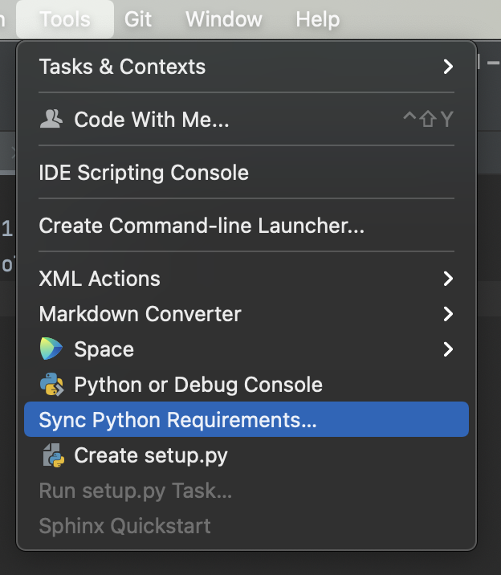

# Development

## Export Requirements

In order to run the tests automatically, we must have a `requirements.txt` file.

This code was edited in PyCharm. It is easy to automatically generate the file.

Commit this to the repository.
